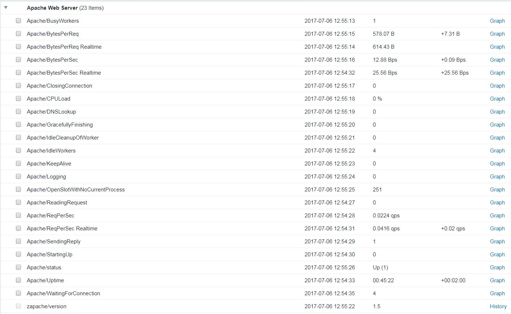

# Apache monitoring script for Zabbix

Forked from https://github.com/lorf/zapache/network

## Requirements

Zabbix 2.0 or later

## Installation 

### Apache Configuration

Apache server-status provided by [mod_status](https://httpd.apache.org/docs/2.2/mod/mod_status.html) must be enabled.

Attached example configuration [httpd-server-status.conf.sample](httpd-server-status.conf.sample) for Apache can be installed on the Apache server as follows:

```
cd /tmp
curl -O https://raw.githubusercontent.com/digiapulssi/zapache/master/httpd-server-status.conf.sample
install -o root -g root -m 0644 httpd-server-status.conf.sample /etc/httpd/conf.d/httpd-server-status.conf
service httpd restart
```

### Zabbix Agent Configuration

The monitoring script must be install on Zabbix Agent for local agent monitoring.

Install the attached configuration file [zapache.conf](zapache.conf) and script file [zapache](zapache) as follows:

```
cd /tmp
curl -O https://raw.githubusercontent.com/digiapulssi/zapache/master/zapache
curl -O https://raw.githubusercontent.com/digiapulssi/zapache/master/zapache.conf
install -o root -g root -m 0755 -d /etc/zabbix/scripts
install -o root -g root -m 0755 zapache /etc/zabbix/scripts/zapache
install -o root -g root -m 0644 zapache.conf /etc/zabbix/zabbix_agentd.d/zapache.conf
service zabbix-agent restart

# Check that the script is working

# Should show Uptime in seconds
su -s /bin/sh zabbix /etc/zabbix/scripts/zapache Uptime

# Should show zapache                                       [t|zapache version: 1.5
#  /etc/zabbix/scripts/zapache [<url>] [<header>] TotalAccesses                 - Check total accesses.
#  /etc/zabbix/scripts/zapache [<url>] [<header>] TotalKBytes                   - Check total KBytes.
#  etc.
su zabbix -s /bin/sh -c "/usr/sbin/zabbix_agentd -p | grep zapache"
```

To perform the monitoring from Zabbix Server instead of the local agent, install the monitoring script instead under 
external scripts of Zabbix Server installation (by default /usr/local/share/zabbix/externalscripts).

### Zabbix Server Configuration

Import [zapache-template.xml](zapache-template.xml) and [zapache-template-active.xml](zapache-template-active.xml) on Zabbix server
and bind "Template App Apache Web Server zapache" OR "Template App Apache Web Server zapache Agent Active" template to Apache host.

### Item Usage

The item supports three usage formats:

- zapache[KPI]
- zapache[URL, KPI]
- zapache[URL, HEADER, KPI]

KPI is one of the metrics supported by the script, eg. CPULoad. See the full list of metrics in [zapache](zapache) function usage() section.

In the first format, Apache server status URL is assumed to be http://localhost/server-status?auto.
In the second format, URL is given as argument. URL can be either ADDRESS (eg. 127.0.0.1), ADDRESS:PORT (eg. 127.0.0.1:8080) or a full http url (eg. https://127.0.0.1:8443/server-status?auto).
In the third format, an optional http header is given as argument (eg. 'Host:example.com').

### Screenshots


